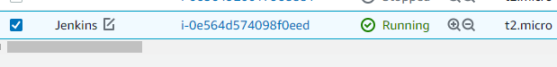
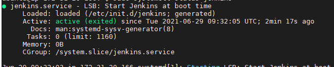
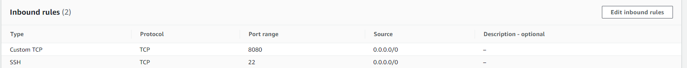
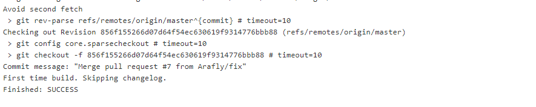
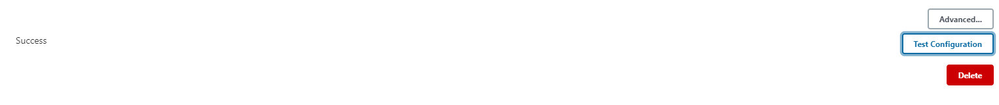
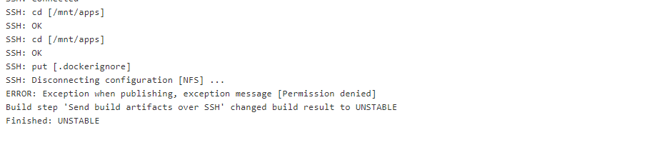
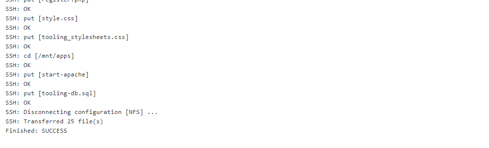

# Tooling Website deployment automation with Continuous Integration. Jenkins

### Launch EC2 instance with Ubuntu


### Install JDK (since Jenkins is a Java-based application)
```
sudo apt update
sudo apt install default-jdk-headless
```

### Install Jenkins
```
wget -q -O - https://pkg.jenkins.io/debian-stable/jenkins.io.key | sudo apt-key add -
sudo sh -c 'echo deb https://pkg.jenkins.io/debian-stable binary/ > \
    /etc/apt/sources.list.d/jenkins.list'
sudo apt update
sudo apt-get install jenkins
sudo systemctl status jenkins
```


### Create inbound rule to open TCP 8080


### Setup Jekins
- Access http://Jenkins-server-public-ip:8080

### Retrieve Jenkins password
> sudo cat /var/lib/jenkins/secrets/initialAdminPassword

## Configure Jenkins to retrieve source codes from GitHub using Webhooks
- Enable webhooks in Github Repo settings
- Create freestyle project on Jenkins
- Use github login credentials
- "Build now"

# Success!

Click “Configure” your job/project and add these two configurations
Configure triggering the job from GitHub webhook:

## Step 3 - Configure Jenkins to copy files to NFS server via SSH
- Install "Publish over SSH" plugin
- Configure Publish over SSH settings
  - Navigate to "Configure System / Publish over SSh
  - Provide, private key, username and remote directory
  - Test Configuration
  
- Save and exit
- Configure freestyle project
- Add new post-build action: Send build artifacts over SSH

## Faced error


Solution: Change /mnt ownership to the user Jekins uses to SSH

>  sudo chown -R ec2-user /mnt



# Success!!
